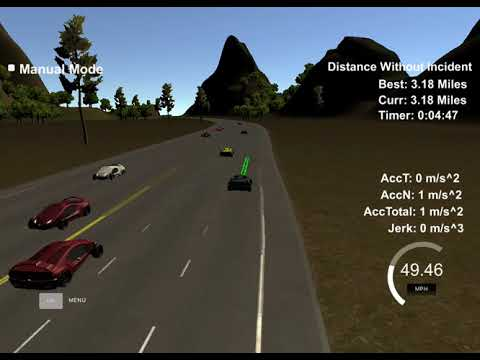

# CarND-Path-Planning-Project
Self-Driving Car Engineer Nanodegree Program

## Introduction
   
### Goals
In this project the goal is to safely navigate around a virtual highway with other traffic that is driving +-10 MPH of the 50 MPH speed limit. One is provided the car's localization and sensor fusion data, there is also a sparse map list of waypoints around the highway. The car should try to go as close as possible to the 50 MPH speed limit, which means passing slower traffic when possible, note that other cars will try to change lanes too. The car should avoid hitting other cars at all cost as well as driving inside of the marked road lanes at all times, unless going from one lane to another. The car should be able to make one complete loop around the 6946m highway. Since the car is trying to go 50 MPH, it should take a little over 5 minutes to complete 1 loop. Also the car should not experience total acceleration over 10 m/s^2 and jerk that is greater than 50 m/s^3.

The software is tested with a simulator that can be found here: https://github.com/udacity/self-driving-car-sim

#### The map of the highway is in data/highway_map.txt
Each waypoint in the list contains  [x,y,s,dx,dy] values. x and y are the waypoint's map coordinate position, the s value is the distance along the road to get to that waypoint in meters, the dx and dy values define the unit normal vector pointing outward of the highway loop.

The highway's waypoints loop around so the frenet s value, distance along the road, goes from 0 to 6945.554.

Below is an image to be able what the simulator looks like.



## Result

[Video of end result](https://raw.githubusercontent.com/Andreas-Jankl/CarND-Behavior-cloning/master/result.mp4)

## Solution

The Code has been divided into 4 sections:

  - 1 = Prepare for state evaluation
  - 2 = Evaluate vehicle state
  - 3 = Create new path points
  - 4 = Send out the points created

### Section 1 Prepare for state evaluation

In this section the preparation for the further calcuation is done. Specifically the following is being done:

  - Find the last waypoint of the previous path if there is enough path points in the previous path
  - Do find the next waypoint associated with the last waypoint of the previous path
  - Setup used variables that are changeable and can be used to tune the model e.g the minimum distance the vehicle must keep to the next vehicle
  - Set the vehicle state to KL = Keep Lane
 
Snippet for first task in section 1:
```sh
if(prev_size < 2)
{
    ...
}
else
{
	ref_x = previous_path_x[prev_size-1];
	double ref_x_prev = previous_path_x[prev_size-2];
	ref_y = previous_path_y[prev_size-1];
	double ref_y_prev = previous_path_y[prev_size-2];
	ref_yaw = atan2(ref_y-ref_y_prev,ref_x-ref_x_prev);
	next_wp = NextWaypoint(....);
	car_s = end_path_s;
	car_speed = (...)/.02)*2.237;
}
```

Snippet for fourth task in section 1:
```sh
VEHICLE_STATES vehicle_state = KL;
```

### Section 2 Evaluate vehicle state

In this section the vehicle state is being evaluated. Specifically:

 - The speed the vehicle shall follow is being determined additionally in this step its being calculated if a lane change shall be considered
 - In case from step 1 there is an indication to consider a lane change this is then being calculated in detail
   
Snippet for the above mentioned tasks:

```sh
evaluate_vehicle_state(...);

if(vehicle_state==LC && ((next_wp-lane_change_wp)%map_waypoints_x.size() > 2)){
    perform_lane_change(...);
}
```
Whats being done in task 1 of section 2:

  - Its being evaluated if there is a vehicle in front of oneself. If there is not then the reference speed is set. If there is the following is being done:
    - The vehicle speeds are set to matching if even after our vehicle has finished the previous path the minimum distance to the vehicle in front can be kept.
    - If the above is not the case. One sets the speed to be a bit lower (5MPH) than the leading vehicle to make sure that we do not collide in the future
    - Additionally since we know there is a vehicle in front the vehicle state is set to LC = Lane Change as there is a clear indiction to investigate whether a LC makes sense. One could also name this state as prepare LC = PLC and put in an additional state LC

Whats being done in task 2 of section 2:

  - First a left lane change is being tried. If the lane change is being actually performed depends on the lane the vehicle is currently in and also if its safe to change into the lane intended. Its safe to change if the minimum distance can be kept.
  - If the left lane change is not possible because we are in the atmost left lane or if its not safe to change in the left lane then a right lane change is being tried.
  - If the right lane change also is not successful the vehicle simply stays in the same lane
  - Please note there is a boolean changed lanes being used. I guess it would have been more structured and more understandable to actually use 3 states KL = Keep Lane, PLC = Prepare Lane Change, LC = Lane Change instead of the two. When using 3 states my current LC state would actually be the PLC state and the boolean changed lanes would be the LC state.

### Section 3 Create new path points

In this section the above calculated lane to be used and the vehicle speed to be used are base to calculate a new trajectory. For this the following is happening:

- Three base points are being calculated. They are evenly spaced by "step distance". The lane being calculated is being used. Additionally the two latest previous path points are being used.
- These 5 points are the basis through which a spline is being planned.
- Now the path vector is being filled. It always comprises out of 50 points. Therefore the "free" waypoints are always being filled with points to reach the first step distance
- Note that in case acceleration or deceleration needs to be done this is always being done incrementally along the waypoints so that jerk and max_acc are not being exceeded.
- For easier calcuations the waypoints are being calculated in the vehicle coordinate system and not in the global coordinate system. This requires transformations to and from the vehicle coordinate system.

### Section 4 Send out the points created

In this section the created paths are simply send ot the simulation


